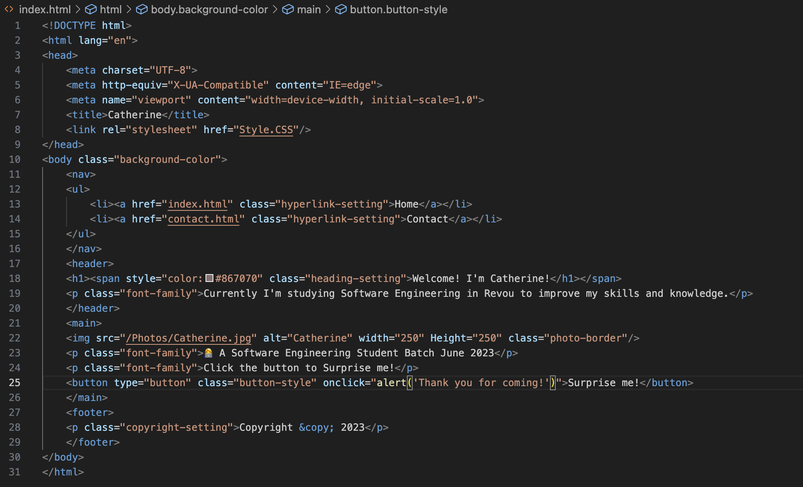
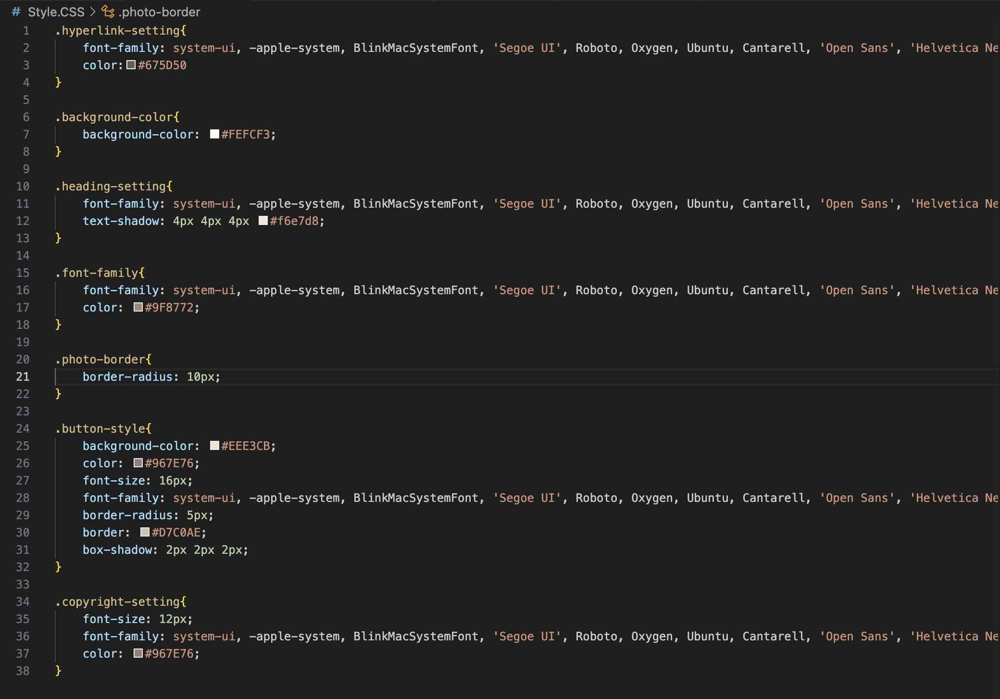
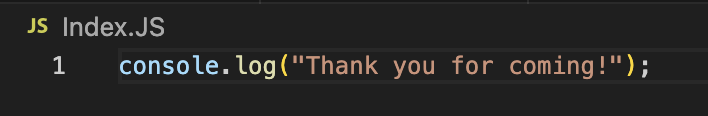
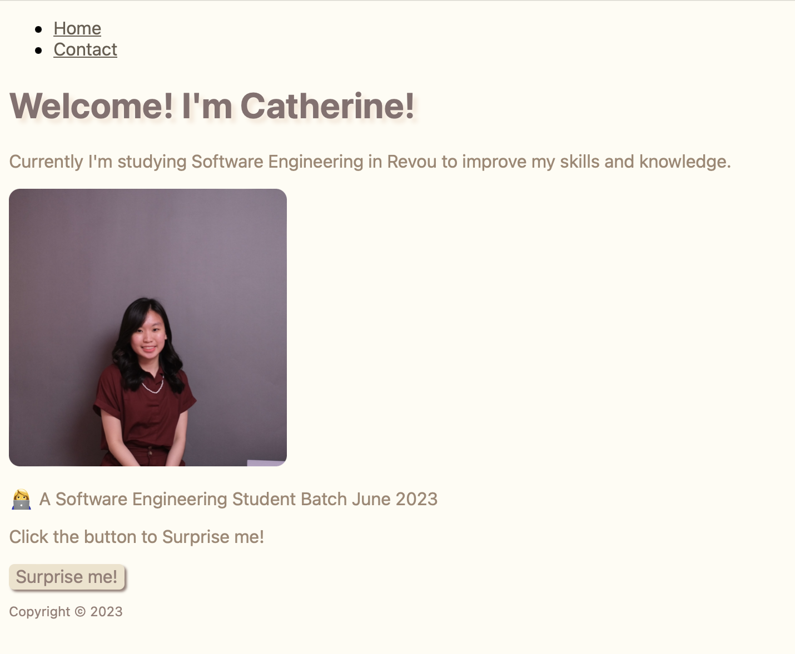

# Hello There! Welcome to my Week 1 Repository

My name is Catherine and I'm a Software Engineering Student in Revou batch June 2023.

For the first week's assignment, we were given a task by RevoU to create a website using HTML, CSS, and Javascript. After the website created locally, we were asked to deploy the website using the Netlify app.

Here are the details of my Repository files:

1. **HTML**: the website is created using HTML5 for the structure and the content with detail as follow:
* Creating page section such as Header, Navigation, Main Content, and Footer
* Using texts such as Heading, Paragraph, Span, and Anchor.
* Adding additional content such as Image and Button.
 

2. **CSS**: to enhance the HTML content, I was asked to add CSS for the visual of the website. In this website, the changes are include font style, background color, font color and border radius.

3. **JavaScript**: to make the website interactive, I'm adding the interaction in the "Surprise me!" button using JavaScript.

And here is the result of my Website using HTML, CSS, and JavaScript.

 